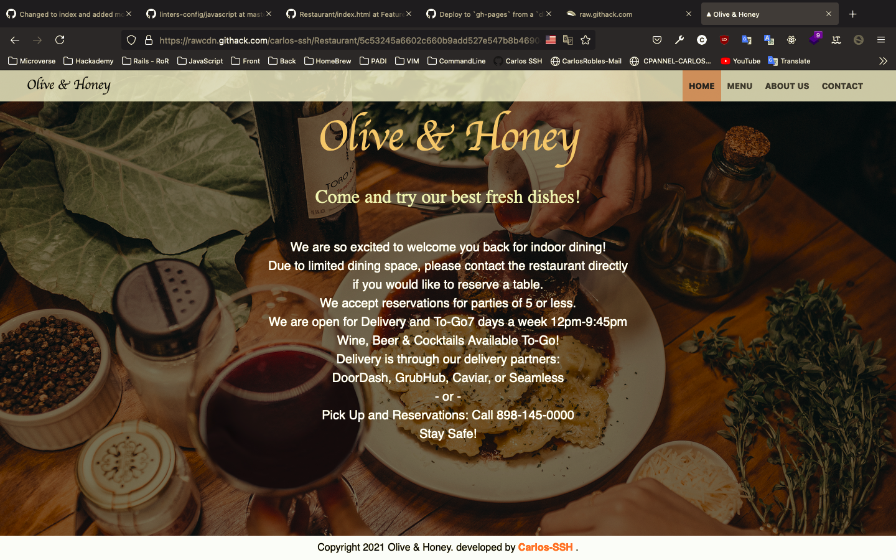

# Restaurant Web Page.

DOM manipulation by dynamically rendering a simple restaurant homepage! By the end, we are going to be using JavaScript alone to generate the entire contents of the website!.




## Live View

[Watch Here!!](https://rawcdn.githack.com/carlos-ssh/Restaurant/5c53245a6602c660b9add527e547b8b4690e2344/dist/index.html)
## Technologies:
- JavaScript
- CSS
- HTML

### To get a local copy of this repo

Run the following comands in the terminal in the next order:

- Step 1:  
  $ cd "here comes the path of your selected directory (double quotes must not be here)"

- Step 2:
  $ git clone https://github.com/carlos-ssh/restaurant.git


## Building and running on localhost

First install dependencies:

```sh
npm install
```

To create a production build:

```sh
npm run build-prod
```

To create a development build:

```sh
npm run build-dev
```

## Running

```sh
node dist/main.js
```

## Author

👤 **Carlos Flores**

- Github: [@Carlos-SSH](https://github.com/carlos-ssh)
- LinkedIn: [Carlos Flores](https://www.linkedin.com/in/carlos-ssh/)

## 🤝 Contributing

Contributions, issues and feature requests are welcome!

Feel free to check the [issues page](https://github.com/carlos-ssh/restaurant/issues).

## Acknowledgments

- Family
- Microverse
- Pexels Images


## 📝 License

This project is [MIT](LICENSE) licensed.

\*\*
Give a ⭐️ if you like this project!